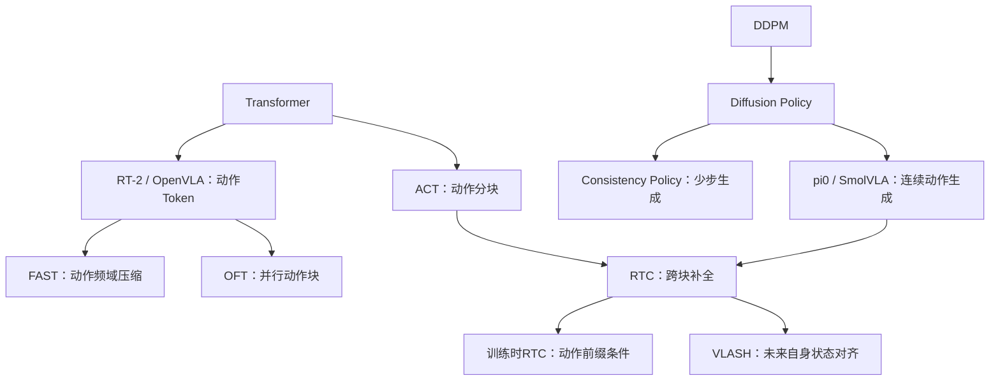
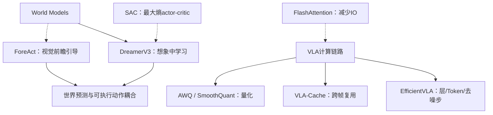

# 技术演进关系

箭头表示概念、结构或研究问题上的联系，不默认表示作者直接引用或完全继承。

```mermaid
flowchart TD
  T["Transformer"] --> A["ACT：动作分块"]
  T --> R["RT-2 / OpenVLA：动作Token"]
  D["DDPM"] --> P["Diffusion Policy"]
  P --> F["pi0 / SmolVLA：连续动作生成"]
  A --> C["RTC：跨块补全"]
  F --> C
  C --> V["VLASH：未来自身状态对齐"]
  C --> TT["训练时RTC：动作前缀条件"]
  R --> O["OFT：并行动作块"]
  R --> FS["FAST：动作频域压缩"]
  P --> CP["Consistency Policy：少步生成"]
```

```mermaid
flowchart TD
  WM["World Models"] --> DR["DreamerV3：想象中学习"]
  SAC["SAC：最大熵actor-critic"] -.-> DR
  WM -.-> FO["ForeAct：视觉前瞻引导"]
  FO --> WAM["世界预测与可执行动作耦合"]
  DR --> WAM
  VLA["VLA计算链路"] --> Q["AWQ / SmoothQuant：量化"]
  VLA --> CA["VLA-Cache：跨帧复用"]
  VLA --> EV["EfficientVLA：层/Token/去噪步"]
  FA["FlashAttention：减少IO"] -.-> VLA
```

SAC虚线用于学习背景，不主张DreamerV3直接采用SAC。DDPM与流匹配有概念联系，但目标与时间方向不同。ForeAct和VLASH预测对象不同。
